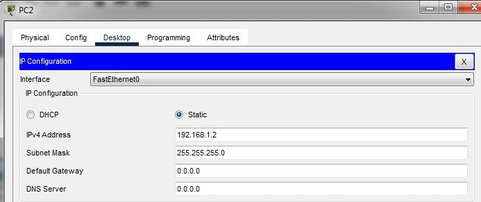
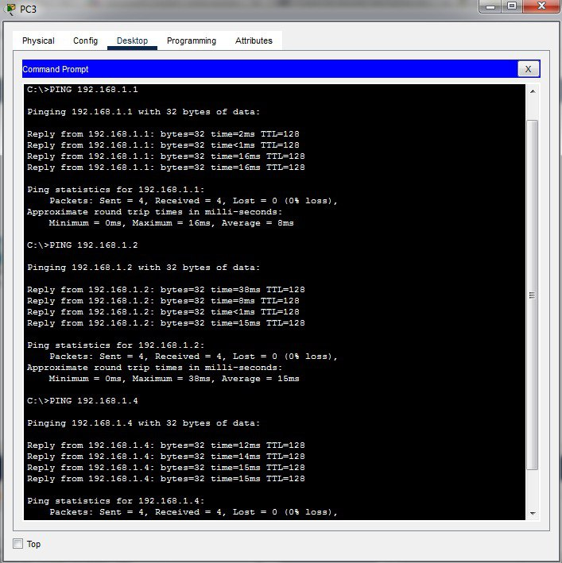

# TP1 Rapport

## Équipe
- Wail Bentafat
- Ouledlaid Zineb
- Messadaa Soufiane
- Kamyl benkhlifa

## Réponses

1. On utilise un switch pour être un équipement intermédiaire qui relie les PC dans un LAN.

2. On utilise le cablage straight-through parce quon a deux differents types de materiel: PC et switch.

3. Le réseau

   

   La topologie du réseau montre une configuration en étoile avec:
   - 4 PC (PC1, PC2, PC3, PC4) connectés à un switch central 
   - Le switch sert de point central de connexion pour tous les périphériques

4. L'adresse IP

   Configuration des adresses IP pour chaque PC:
   
   | Poste | Adresse IPv4    | Masque de sous-réseau |
   |-------|-----------------|------------------------|
   | PC1   | 192.168.1.1     | 255.255.255.0         |
   | PC2   | 192.168.1.2     | 255.255.255.0         |
   | PC3   | 192.168.1.3     | 255.255.255.0         |
   | PC4   | 192.168.1.4     | 255.255.255.0         |
   
   
   
   
   

   

5. Ping

    
    
    
    
    

   